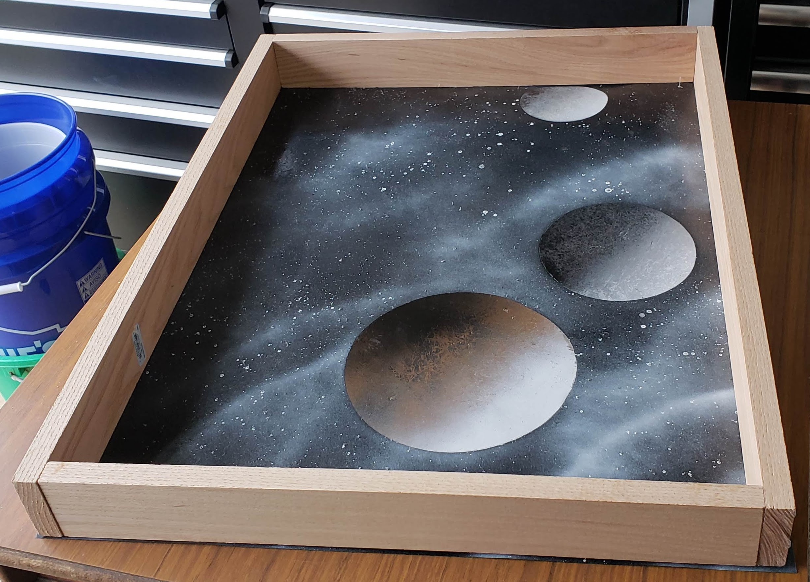
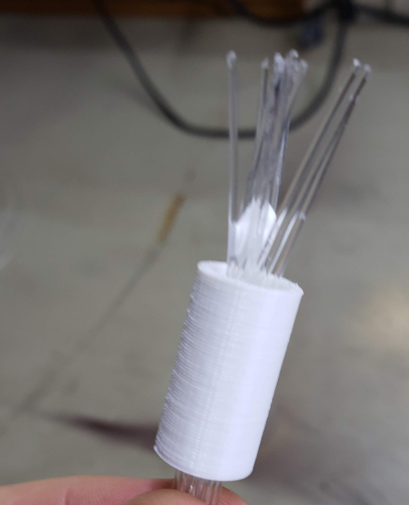
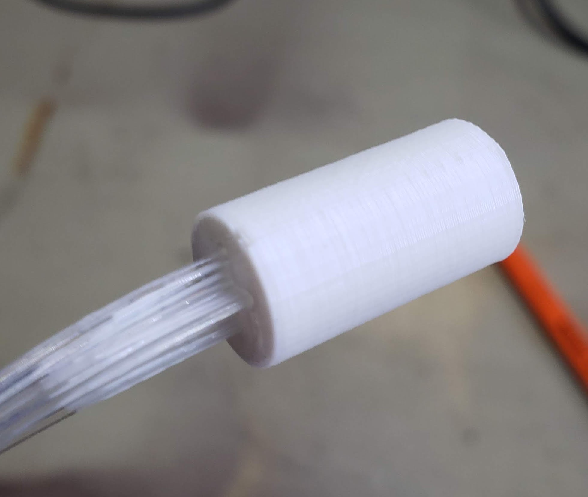
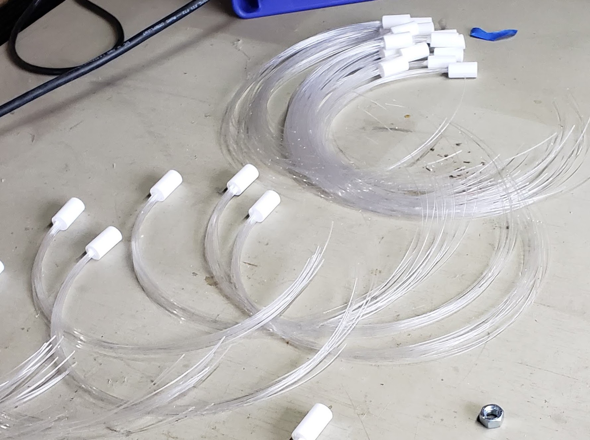
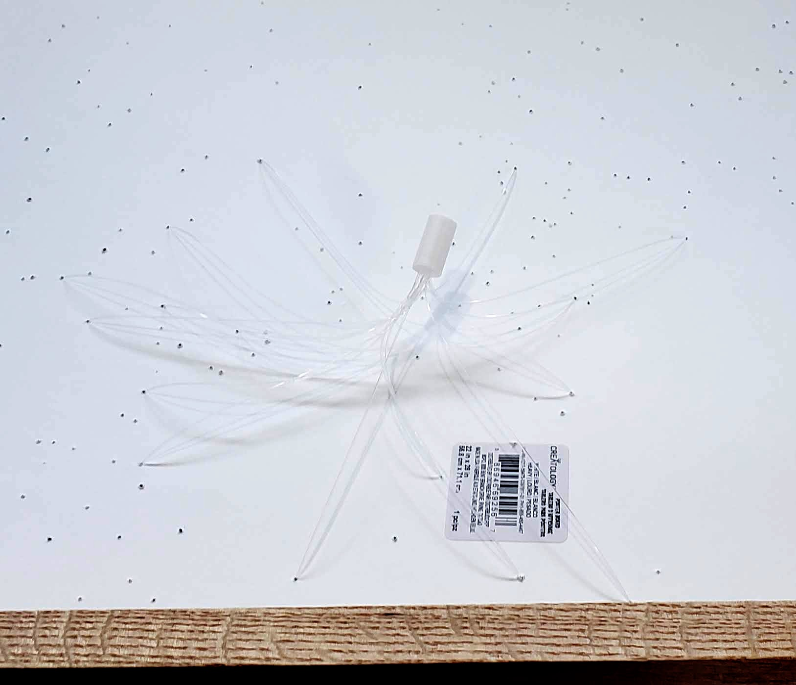
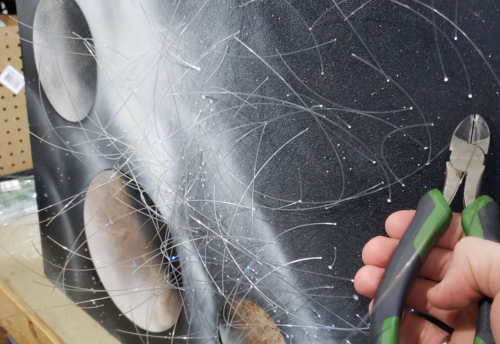
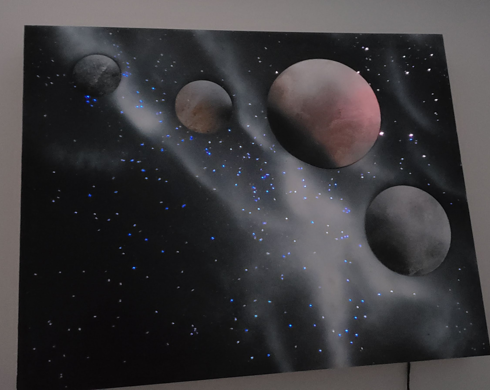

## Overview

A very simple LED animated spray-paint space screen.

## Requirements

- Poster board
- Spray paint
- Fibre optic cable
- Programmable LEDS (WS2811 in my case)
- Arduino
- 3D printer
- Weldbond (or other glue)

## Steps

### Space Scene

- Create a spray-paint space scene with stars as described in any of the many YouTube videos on the subject.
- Build a simple wooden frame and glue the painting to the front

### Fiber Optics

- Cut batches of fiber optic cables
- Push through 3d printed attachments (see STL)
- Align ends of batch
- Put a dab of glue between cables

- Pull back until glue binds to 3d printed part

- Allow to dry

### Attach

- Push fiber optics through holes in a random, spread out, overlapping pattern.

- Put a dab of glue on each hole
- Allow to dry
- Clip ends flush to the painting

### Control

- Plug controllable LED into each 3d printed mount
- Attach LED chain to Arduino (A0 for brightness input potentiometer, pin 7 for LED control)
- Run stars.ino

## Final Result

A nice moving rainbow space lit up scene with brightness control.

#### Code Quality

This code is hideous, but short and simple enough to get the job done without much fuss.